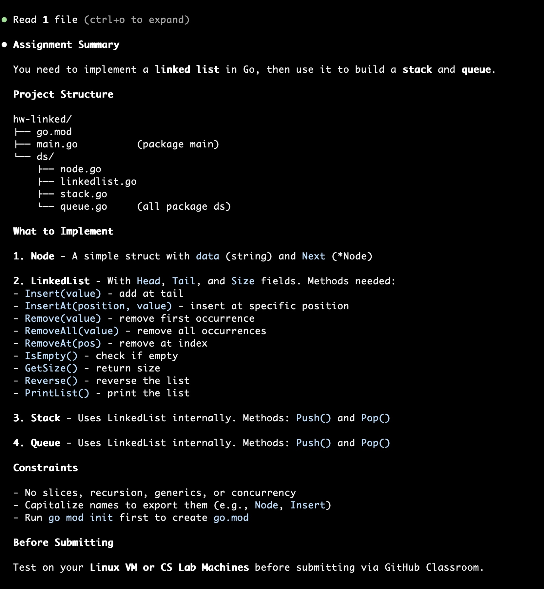
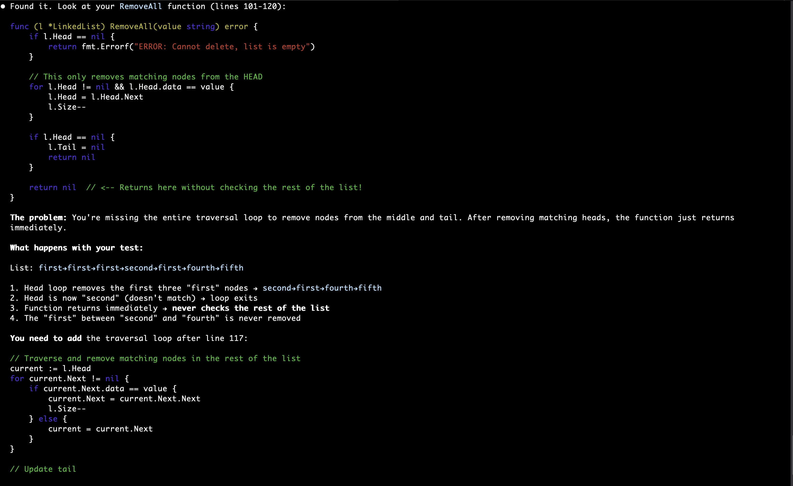
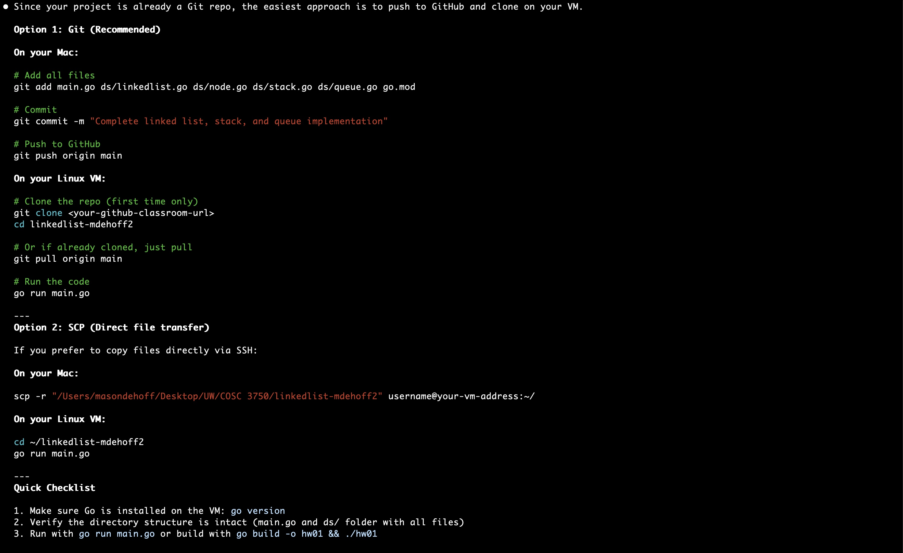
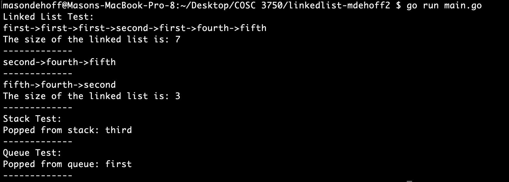
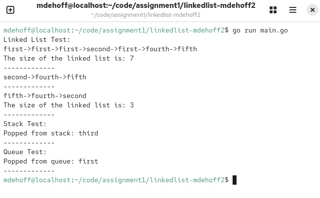

# Mason DeHoff
## Assignment #1
## [Submission date: 2/3/2026]

## Worked with/sources 
* Claude Opus 4.5. 2026, February 1. "Read the COSC3750_Go_Linked_List_Assignment.md file and summerize the goals for my assignment please" Generated using Claude Code (inside terminal). Since I cannot provide a URL, here is Claude's response:

* Claude Opus 4.5. 2026, February 3. "There seems to be a bug in my RemoveAll function after testing, can you look at the function and point out the error to me and tell me what is going wrong." Generated using Claude Code (inside terminal). Since I cannot provide a URL, here is Claude's response:

* Claude Opus 4.5. 2026, February 3. "I want to now test this code on my Linux VM, can you please give me the commands and instructions on the best and most efficient way to do so?" Generated using Claude Code (inside terminal). Since I cannot provide a URL, here is Claude's response:

## Project Quirks/ Things that don't work
* Nothing I found from my testing

## Output Screenshots
On Mac:

On Linux VM:
